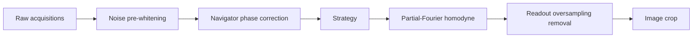

# Calibration passes

OpenKSpace runs a fixed sequence of calibration passes before the
reconstruction strategy proper. Each pass can be disabled
individually via a CLI flag or `ReconConfig` field; the order is
fixed and cannot be re-ordered.

## Noise pre-whitening

Per-coil noise covariance estimated from the dedicated noise scans
in the file, decomposed via Cholesky, and applied as a
whitening transform to all image-domain acquisitions
(Kellman & McVeigh 2005). Disable with `--no-prewhiten` if your
file has no noise scans.

## Navigator-echo phase correction

For sequences that include `ACQ_IS_PHASECORR_DATA` lines (EPI-style
navigator echoes), OpenKSpace estimates the linear phase per coil
and applies the inverse to imaging lines, removing N/2 ghosting.
Disable with `--no-phasecorr`.

## Readout oversampling removal

Standard 2x readout oversampling is removed by IFFT along kx and
cropping the central half in image space, then optionally
re-FFTing if a downstream strategy requires k-space. Disable with
`--no-oversampling-removal`.

## Partial-Fourier homodyne

For acquisitions with partial-Fourier ky sampling, the missing
high-frequency data is reconstructed via homodyne filtering
(Noll 1991; McGibney 1993). Disable with `--no-partial-fourier`.

## FOV crop

Final image-space crop to the encoded FOV. Disable with
`--no-crop`.
